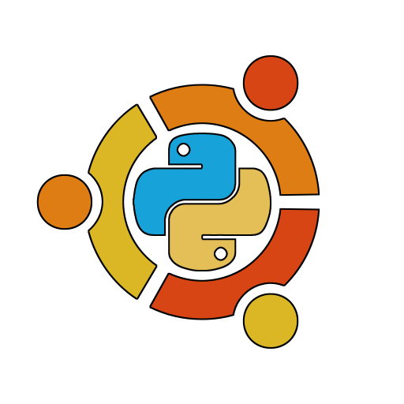
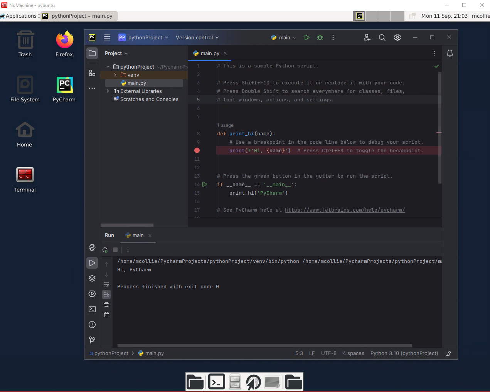

<table align="center"><tr><td align="center" width="9999">

# Pybuntu

 
</td></tr></table>

This project shows a simple example of how you can run an entire Desktop environment inside  a Docker Container.
It's using Ubuntu 20.04 LTS and comes with the following pre-installed:
- Python 3.10.13
- Python 3.8.10
- Firefox 117.0

You choose your version of Pycharm and Nomachine.  The Dockerfile will download and install them for you.

## Possible use cases
Some novel use cases for these would be (but aren't limited to):

- **isolated/preconfigured/repeatable** development environments - simplifies dependency management and setup
- **secure internet browsing** - ensures no malicious malware is present after the session ends
- **software testing/evaluation** - test new software/libraries on a clean system without any possible conflicts from the host libraries and/or runtime environment/configuration
- **training & workshops** - ensure uniformity for training environment and runtime, simplifying instructions and troubleshooting
- **legacy application support** - run older versions of applications or operating systems without affecting the host
- **remote work** - people can pull the image to their local machine for replication of the work environment(s)
- **forensic analysis** - analyze potentially harmful files in a secure manner
- **software versioning** - bake a particular version of a DCC and it's dependencies into a container simplifying version management, allowing for seamless project transitions
- **onboarding** - preload with some DCCs and some content for training new staff in a consistent and repeatable manner by standardizing the setup
- **archiving old projects** - makes  it easier to work on older projects as the runtime, dcc version, and dependencies can be 100% replicated
- **compliance and security** - really easy way to help ensure you are meeting MPA & TPN compliance within your organization
- **resource allocation** - reduce your costs by having more than one container run on a host


## Getting started
1. clone the repository
```
git clone https://github.com/mgcollie/pybuntu.git
cd pybuntu
```
2. Make any edits you want to the .env file


3. Run the container
```
docker-compose up --build -d
```

4. Connect using your local NoMachine client
Then fire up your local client of nomachine and configure it to connect to localhost:4000


