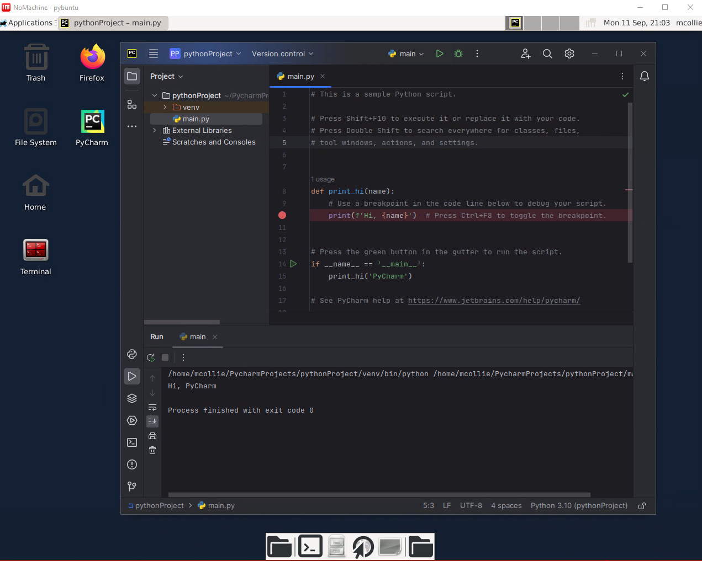

<table align="center"><tr><td align="center" width="9999">

# Pybuntu

 
</td></tr></table>

This project shows a simple example of how you can run an entire Desktop environment inside  a Docker Container.
It's using Ubuntu 20.04 LTS and comes with the following pre-installed:
- Python 3.10.13
- Python 3.8.10
- PyQT 5
- Firefox 117.0

You choose your version of Pycharm and Nomachine.  The Dockerfile will download and install them for you.


## Getting started
```
git clone https://github.com/mgcollie/pybuntu.git
cd pybuntu
```
You'll then need to create a .env file and define the following variables:
- PYCHARM_VERSION=<version>
- USER=<somename>
- PASSWORD=<somepassword>
- NOMACHINE_PACKAGE_NAME=<packagename>
- NOMACHINE_BUILD=<build>

Then you'll be able to launch the container using this command
```
docker-compose up --build -d
```
Then fire up your local client of nomachine and configure it to connect to localhost:4000


